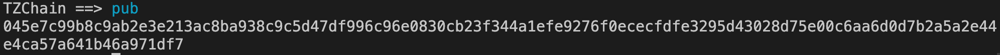

# TZChain
> My contact info: [Twitter](https://twitter.com/dvzhangtz) [Linkedin](https://www.linkedin.com/in/tianzuo-zhang/) Wechat: dvzhangtz
> 
> Thanks to shengxinjing/iblockchain, learn a lot from that repository.

## Start
```npm start```


## Command
#### chain: View the entire blockchain data


#### mine: Mining, new blocks 


#### pub: View local address (public key) 


#### trans: Transfer 


#### pending: View unpacked transactions 
#### blance: View address balance (default local)) 
#### peer: View list of network nodes 
## Demo commands
#### help: help 
#### hash: Calculate sha256 hash 
#### minedemo: Demonstrate mining logic 

#### getpub: Calculate the public key from the private key 
#### sign: RSA private key encryption 
#### verify: RSA public key verification signature 
#### valid: Verify that the blockchain is legitimate 
#### update: tamper with blockchain transaction data 
#### exit: exit 


